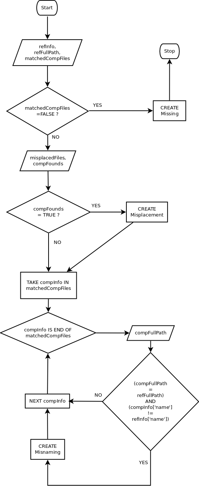

Module **compare**
==================

.. automodule:: compare
   :members:
   :private-members:

.. autoclass:: Handler
   :members:
   :private-members:

**Part of the flowchart for the creation of elements of comparison (Misnaming, Mispalcement, etc)**

